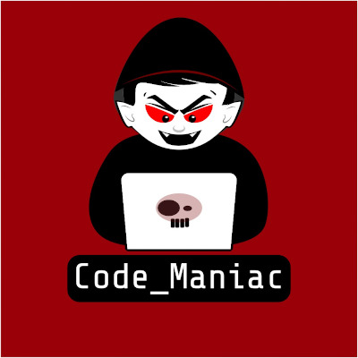

# CoronaStrike

Here is our College project repo to build a python game using PyGame.
----THE CORONA STRIKE-----
Corona Strike

Group Name -  _Blank_
Class -Div2
Batch- S1
Group Members :
1.) Sarah Hussain -111803124
2.) Prajjwal Datir - 111803131
3.) Siddhika Bejekar - 11180136

Reason for selecting Problem: 

So many people are working on developing the medicines, apps and websites which will help limit the corona spread.
But no one made a game for people who are getting bored because of the quarantine. 
The more we engage people with the activities the lesser the chance of them breaking the quarantine. 
Also making a CoronaStrike game was an unique idea because instead of feeding people with too much scary corona news
like live deaths and more scary incidents it brings out the positivity and sense of relief.
And honestly who doesn't like playing relatable games and especially in this quarantine period.
Thus we selected to work on the game.
 

Current state of art to solve the problem:  

Currently, even though there are many games in windows store ,steam and play store yet most of them are heavy-to-run.
Also "Not a One" of them is related to current corona pandemic 
which doesn't gives player a sense of connection between game and the player.

Your solution to problem :
So we made a game where you can fight with the Covid-19 virus virtually. 
And get the revenge of all the future plans it cancelled.
We tried to keep it as relatable and easy to play as possible.
All age groups can play it because of it's simple gameplay.

Technology used : 
Technology stack:
	Programming language: Python3
	base module used : python-pygame
	all the characters and icons are self made using Adobe Illustrator, Gimp, Inkscape and Photoshop.
	
Future developments : 
There are tons of development possibilities like adding story mode which is again not resouse heavy but needs time to implement.
Making it multiplayer online. Where you can play with your friends and destroy viruses together.
Adding Boss mode: Boss mode development is under progress due to lack of idea for unique boss we paused the development of boss level
Making the game locally multiplayer: We are also working on this currently.
Giving powerups etc.

Github link :https://github.com/PrajjwalDatir/CoronaStrike

licensed by Code_Maniac
